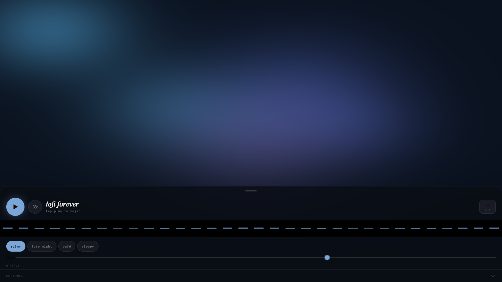
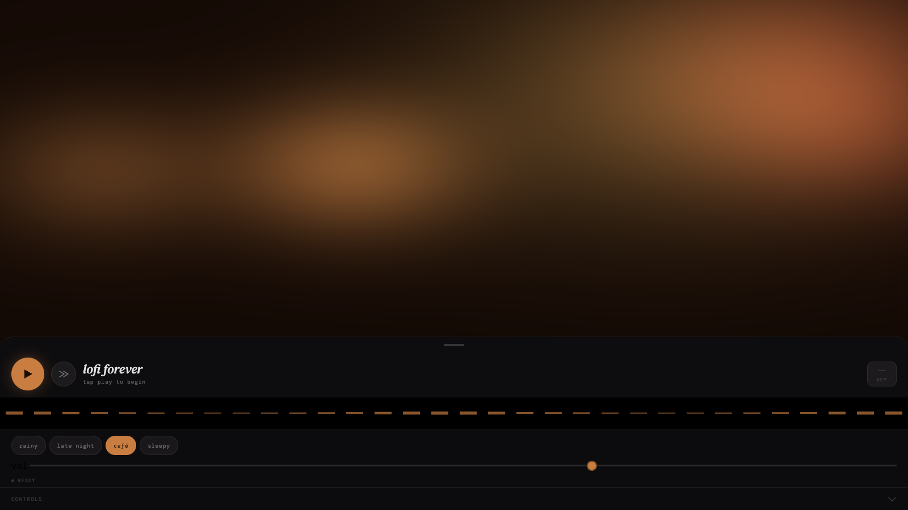

# lofi forever

Low-key lofi beats for chilling or concentration while you vibe-code (or raw-code) your latest and
greatest.

→ **[Try it](https://ee0pdt.github.io/lofi-stream/)**

You know the vibe. Headphones on, a rainy window somewhere in your peripheral vision, a cup of
something warm, the deadline somewhere out of frame. _lofi forever_ is that — generated note by note
in the browser, fresh every bar.

## Four moods

- **rainy** — grey afternoon, window seat, soft rain
- **late night** — 3am brew, city lights, last bus
- **café** — warm espresso, cosy corner, notebook
- **sleepy** — almost asleep, blanket hour, dim lamp

Pick one and the player improvises forever. Fresh chord voicings every bar, warm rhodes and vibes, a
little tape wobble, optional rain or café murmur. It never repeats.

## What it is, what it isn't

One browser tab that plays forever. No account, no ads, no algorithm picking the next track. Just
open it.

## For developers

Vanilla TypeScript on top of the Web Audio API — no frameworks, no runtime dependencies. See
[`CONTRIBUTING.md`](./CONTRIBUTING.md) to run it locally, or
[`docs/ARCHITECTURE.md`](./docs/ARCHITECTURE.md) for how it's put together.

## Licence

MIT — see [`LICENSE`](./LICENSE).
